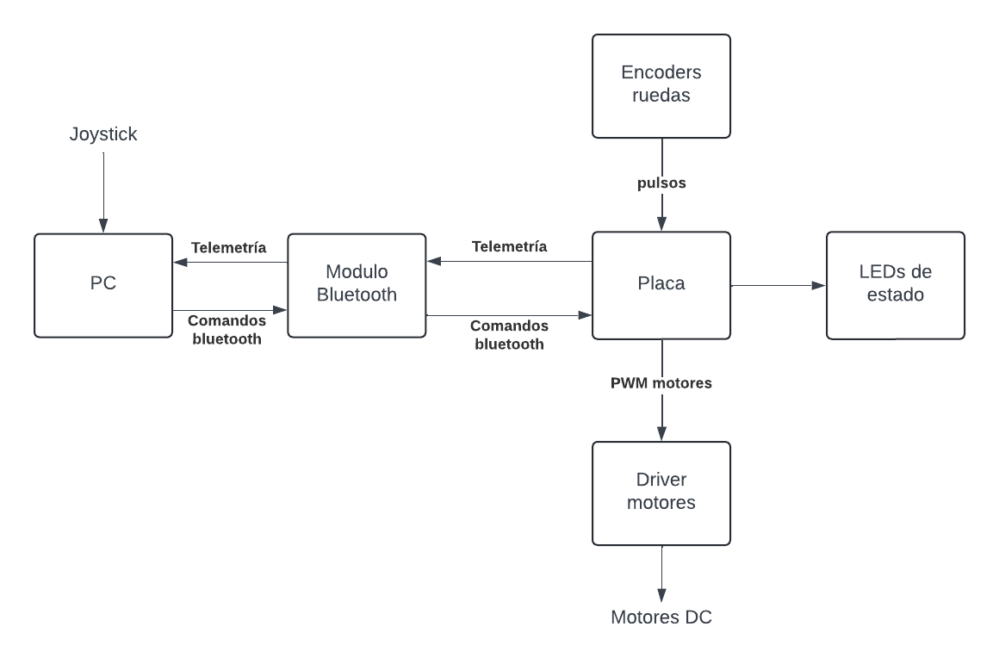

# Control de tracción y control de velocidad para un auto a control remoto

## Resumen

El proyecto consistirá de un pequeño auto a control remoto que implementará un sistema de control de tracción (TC) y de control de velocidad (CC). Con un sistema de control de tracción, cuando una rueda con tracción patina, la computadora detecta este evento y reduce la fuerza del motor hacia esa rueda para evitar el deslizamiento excesivo, mejorando así el agarre. El auto no tendrá dirección, irá en linea recta. Se manejará con un joystick mediante comandos bluetooth. El joystick estará conectado a un software de PC, el cual mandará los correspondientes mensajes al auto mediante bluetooth. También se transmitirá telemetría del auto a la computadora a través de este medio. La telemetría se graficará en la PC. Dos ruedas tendrán tracción (directa), las otras dos serán libres. La detección de patinaje se hará mediante la utilización de tres encoders incrementales ópticos: uno en cada rueda con tracción, y otro en una de las dos ruedas libres. El sistema de control de velocidad permitirá configurar una velocidad que el auto deberá intentar mantener de forma constante.

## Objetivos

### Objetivo general

Implementar un sistema de control de tracción para mejorar la aceleración de un auto a control remoto ante una situación de patinaje. En general, la mejor aceleración posible se obtiene cuando las ruedas experimentan un poco de deslizamiento (entre 5% y 10%). Es decir, se busca implementar un deslizamiento controlado de las ruedas.
También se busca implementar un control de velocidad que permita configurar la velocidad deseada, de forma que la computadora del auto se encargue de manejar la aceleración.

### Objetivos específicos
- Medir las velocidades de las distintas ruedas utilizando encoders incrementales.
- Detectar patinaje de las ruedas utilizando los datos de los encoders.
- Ajustar la potencia de los motores en base a la aceleración deseada por el usuario (i.e., que tanto intenta acelerar con el joystick), pero limitada por el control de tracción cuando sea necesario para evitar patinaje. La potencia de los motores se regula mediante PWM. Esta parte requerirá de un controlador PID para lograr el deslizamiento óptimo de las ruedas. Si el control de velocidad se encuentra activado, entonces los motores deberán mantener una velocidad constante, incluso al someterlos a esfuerzos diferentes (como por ejemplo, intentando frenarlos con la mano). En tal caso, se utilizará el mismo controlador PID.
- Implementar un protocol de comunicación bluetooth para los comandos de control del auto y para la telemetría. Esto último permitirá observar mediante gráficos los datos que el auto procesa.
- Graficar la telemetría en la PC.

## Descripción funcional del sistema

### Diagrama de bloques

### Entradas y salidas

#### Entradas
- Sensores: 
    - Tres encoders incrementales ópticos.
- Interfaz de usuario:
    - Un joystick para control de aceleración, entre otros.
- Señales de red:
    - Comandos bluetooth que se originan en una PC.

#### Salidas
- Motores: dos motores DC. Se controlará la potencia de estos mediante dos señales PWM.
- Habrán varios LEDs sobre el auto que indicarán distintas condiciones, como detección de deslizamiento, control de tracción activado, etc.
- El auto enviará información mediante bluetooth para visualizarla en la PC.

## Requisitos de tiempo real

La detección del deslizamiento de las ruedas (y el ajuste de potencia de los motores) requiere de tiempos de procesamiento muy cortos y consistentes. Esta sería la sección critica. Por otro lado, un apartado no tan importante con respecto a los tiempos sería la recepción de comandos bluetooth. Por último, la telemetría representa una tarea intensiva en términos de procesamiento (ya que se utilizarán funciones de transmisión bloqueantes), pero de muy baja prioridad. 

## Arquitectura de Software y diseño en FreeRTOS

### Tareas (en orden de prioridad, mayor a menor):
- Tarea de control de tracción (y de control de velocidad): se encarga de detectar el deslizamiento, y de implementar el control PID para la potencia del motor. También tiene en cuenta el control de velocidad en caso de que este se encuentra activado.
- Tarea de recepción de comandos bluetooth: se encargar de recibir comandos de control de la PC y procesarlos.
- Tarea de telemetría bluetooth: se encarga de enviar información a la PC para su visualización.

### Sincronización y comunicación
- Comunicación entre tareas: 
    - La tarea de comunicación bluetooth le enviará información a la tarea de control de tracción utilizando variables compartidas. 
    - La tarea de control de tracción escribirá continuamente en una estructura compartida, que la tarea de telemetría leerá cuando decida enviar un paquete a la PC. 
    - No se implementará exclusión mutua para ninguno de estos datos compartidos, puesto a que por como está implementado, no es crítico para el buen funcionamiento del sistema.
- Manejo de interrupciones (ISRs): 
    - Se configurará un timer que generará interrupciones cada cierto tiempo para despertar la tarea de control de tracción.
    - Se generarán interrupciones cuando se reciban datos mediante bluetooth (UART).
    - Se configurará otro timer que despertará a la tarea de telemetría, especificando la frecuencia con la que se enviarán estos datos.

## Arquitectura de Hardware
- Hardware: NUCLEO-H533RE.
- Módulo bluetooth HC-06.
- Driver motores DC.
- Timers:
    - 1 timer para los tres encoders incrementales de las ruedas, con un canal por cada encoder configurado en modo de captura.
    - 1 timer que define la frecuencia en la que se ejecuta la tarea de detección de deslizamiento.
    - 1 timer que define la frecuencia en la que se ejecuta la tarea de telemetría.
    - 1 UART para la comunicación bluetooth serial.
- LEDs de distintos colores.

## Metodología de validación
- Idealmente, se debería poder apreciar con el ojo humano que el auto acelera más rapido cuando el sistema de contol de tracción se encuentra activado. Por otro lado, al activar el control de velocidad, se debería ver que se mantiene la velocidad que el auto tenía al momento de presionar el botón de activar el control de velocidad.

## Grado de avance
El proyecto no se encuentra finalizado. Actualmente se tiene el ensamblaje que une cada motor con su encoder correspondiente. También se encuentra configurado y andando correctamente todo lo relacionado a bluetooth. Todos los periféricos (y los servicios HAL correspondientes) fueron probados. Un problema encontrado es que los encoders incrementales no son precisos en cuanto a la consistencia con los anchos de pulsos, por lo cual la medición de la velocidad angular de las ruedas es ruidosa. Es probable que esto dificulte o hasta imposibilite la implementación del control de tracción. Sin embargo, el control de velocidad sí debería poder ser implementado a pesar de esto, aunque quizás menos responsivo de lo deseado.

Por el lado del firmware, el proyecto está prácticamente terminado. Sólo queda terminar de conectarlo con el hardware y realizar las calibraciones necesarias (parámetros de PID, técnicas de filtrado para los encoders, etc.). Todas las pruebas fueron realizadas sobre las tareas descriptas anteriormente.

El software que corre en la PC también se encuentra completo casi en su totalidad: ya envía mensajes en base al estado del joystick, y grafica la telemetría que recibe del auto.

